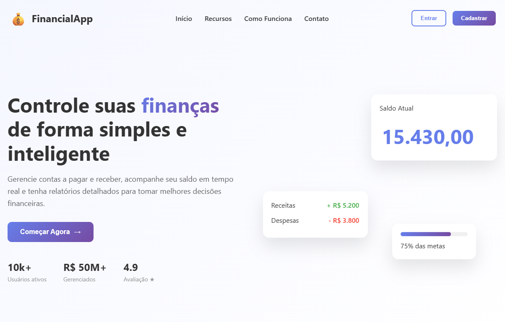
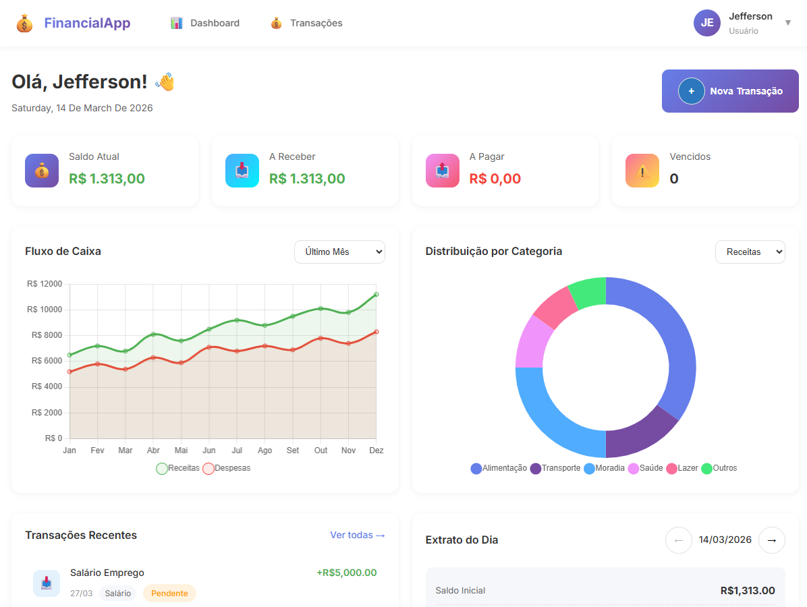
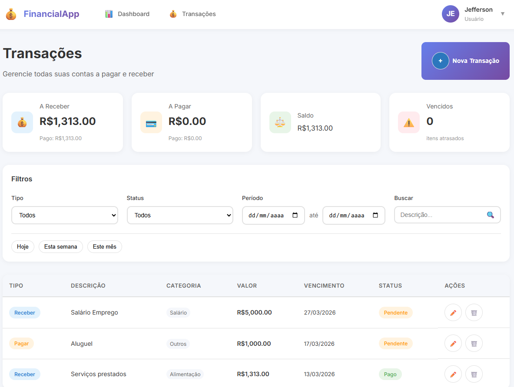

# 💰 Financial App - Sistema de Gestão Financeira

<div align="center">


</div>

🌎 **Languages**

- 🇺🇸 English
- 🇧🇷 [Português](README.md)


# 📋 About the Project

**Financial App** is a simple **personal financial management application**, built with a modern architecture based on **Go + Angular + PostgreSQL + Docker**.  
I created this project to practice and deepen my studies with the **Golang programming language**.

The system provides control of **accounts payable and receivable**, an **interactive dashboard**, **financial charts**, and **detailed reports**.

## This project was developed with focus on:

- Clean architecture
- Backend best practices
- Modern and responsive frontend
- Containerized infrastructure
- Production-ready code


# 🎥 Demo

## Project Video

[](https://youtube.com)

Click the button above to watch the **complete project demonstration**.

## Interface Demo

### Home Page (SPA)


### Dashboard



### Transactions List



### Create Transaction


# 🏗️ System Architecture
```
financial-app
│
├── backend (Go)
│   ├── domain
│   ├── application
│   ├── infrastructure
│   └── interfaces
│
├── frontend (Angular)
│   ├── components
│   ├── services
│   ├── pages
│   └── shared
│
├── docker
└── docker-compose.yml
```

## Backend Architecture

The backend follows **Clean Architecture** principles:
```
Controller → UseCase → Domain → Repository
↓
Database
```


Benefits:

- Low coupling
- High testability
- Easy maintenance
- Framework independence

---

# 🚀 Technologies Used

## Backend

| Technology | Description |
|---|---|
| Go | Main programming language |
| Gin | Web framework |
| GORM | ORM |
| PostgreSQL | Database |
| JWT | Authentication |

---

## Frontend

| Technology | Description |
|---|---|
| Angular 17 | SPA framework |
| TypeScript | Static typing |
| RxJS | Reactive programming |
| Chart.js | Charts |
| Bootstrap 5 | Responsive UI |
| NGX-Toastr | Notifications |

---

## DevOps

| Technology | Usage |
|---|---|
| Docker | Containerization |
| Docker Compose | Service orchestration |

---

# ✨ Features

## 🔐 Authentication

- User registration
- JWT login
- Access control (Admin/User)
- Route protection
- Session persistence

---

## 💳 Financial Transactions

- Full CRUD
- Accounts payable
- Accounts receivable
- Categorization
- Payment status

---

## 📊 Dashboard

- Financial summary
- Cash flow chart
- Category distribution
- Recent transactions
- Upcoming due dates
- Daily statement

---

## 📑 Reports

- Financial statement
- Period summary
- Advanced filters
- Pagination

---

# 🗄️ Data Model

## Users

```sql
CREATE TABLE users (
    id UUID PRIMARY KEY DEFAULT gen_random_uuid(),
    name VARCHAR(100) NOT NULL,
    email VARCHAR(100) UNIQUE NOT NULL,
    password VARCHAR(255) NOT NULL,
    role VARCHAR(20) DEFAULT 'user',
    active BOOLEAN DEFAULT true,
    last_login_at TIMESTAMP,
    created_at TIMESTAMP DEFAULT NOW(),
    updated_at TIMESTAMP DEFAULT NOW(),
    deleted_at TIMESTAMP
);

CREATE TABLE transactions (
    id UUID PRIMARY KEY DEFAULT gen_random_uuid(),
    user_id UUID REFERENCES users(id),
    type VARCHAR(20) NOT NULL,
    description TEXT NOT NULL,
    amount DECIMAL(15,2) NOT NULL,
    status VARCHAR(20) DEFAULT 'pending',
    due_date DATE NOT NULL,
    paid_at TIMESTAMP,
    category VARCHAR(50),
    notes TEXT,
    created_at TIMESTAMP DEFAULT NOW(),
    updated_at TIMESTAMP DEFAULT NOW(),
    deleted_at TIMESTAMP
);
```


# ⚙️ Installation
Prerequisites

```
Docker
Docker Compose
Node.js
Go
Git
```

## 1️⃣ Clone the repository
```bash 
git clone https://github.com/seu-usuario/financial-app.git
cd financial-app
```


## 2️⃣ Configure environment variables
```bash
cp backend/.env.example backend/cmd/api/.env
```
Edit the .env file as needed.


## 3️⃣ Run the application
```bash
docker-compose up -d
```

# 🌐 Access
| Service  | URL                                                                                  |
| -------- | ------------------------------------------------------------------------------------ |
| Frontend | [http://localhost](http://localhost)                                                 |
| Backend  | [http://localhost:8080](http://localhost:8080)                                       

# 📚 API

## Main Endpoints
```
Auth
POST /api/v1/auth/register
POST /api/v1/auth/login

Transactions
GET /api/v1/transactions
POST /api/v1/transactions
GET /api/v1/transactions/:id
PUT /api/v1/transactions/:id
DELETE /api/v1/transactions/:id

Dashboard
GET /api/v1/dashboard
GET /api/v1/dashboard/cashflow
GET /api/v1/dashboard/categories
```

# 📱 Responsiveness

Interface adapted for:
```
Desktop
Tablet
Mobile
```

# 🔒 Security
```
Passwords encrypted with bcrypt
JWT authentication
Protection against SQL Injection
XSS sanitization
CORS configured
```


# 🙏 Acknowledgements
```
Go community
Angular community
Project contributors
```

<div align="center">
⭐ If this project helped you, consider giving it a star!
</div>